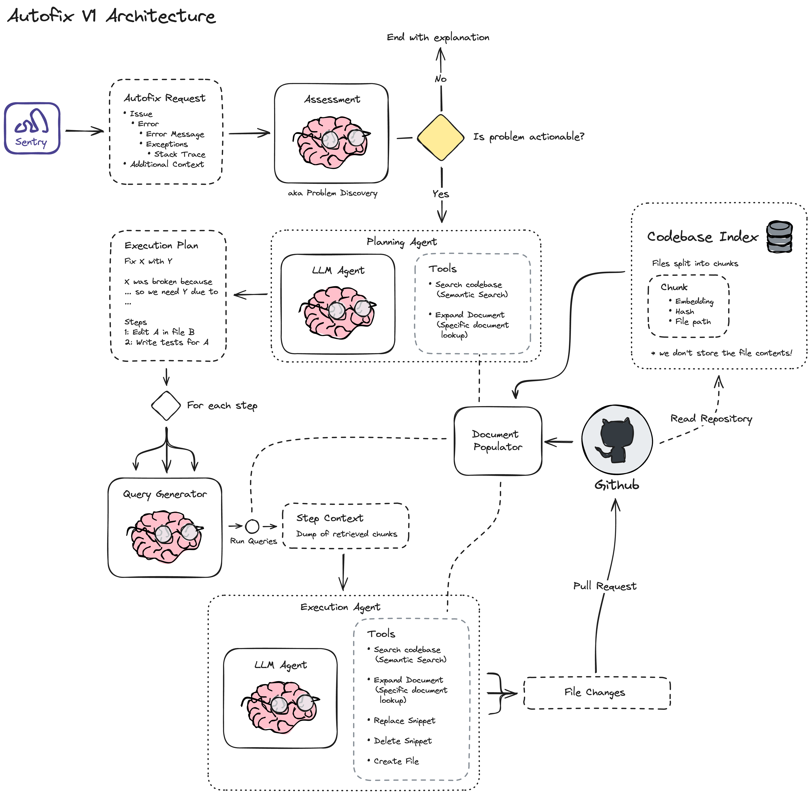

# seer

Seer is Sentry's AI/ML inference service. It is responsible for running inference on events and returning the results to the Sentry application.

## Local Development

### Setup

Use `direnv` or a similar tool that sources `.envrc`.  It will check your python version and setup virtualenv for you.

Recommended to use `pyenv` or similar python environment manager so as to be able to use differing python versions between sentry projects.

### Environment variables

Set the environment variables that are in `.env.example` with the actual values, save this as `.env` in the root of the project.

### Model Artifacts

You will need model artifacts to run inference in seer, get them from gcs by:

```bash
gsutil cp -r gs://tmp_tillman/models ./models
```

### Running

To run for development locally in one ago including building the docker image and rabbitmq container:

```bash
make dev # runs docker-compose up --build
```

Port `9091` will be exposed which is what the local sentry application will look for to connect to the service.

## Services

Seer houses multiple AI/ML-powered services:

### Autofix

Autofix is an LLM pipeline that is responsible for automatically fixing Sentry issues. It takes a Sentry issue, its exceptions and its context and creates a fix for it with a Github PR.



### Issue Severity

### Issue Grouping

### Breakpoint Detection
